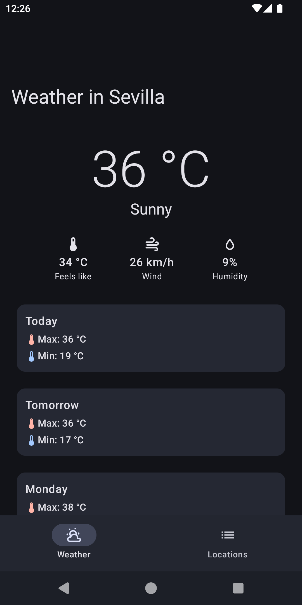
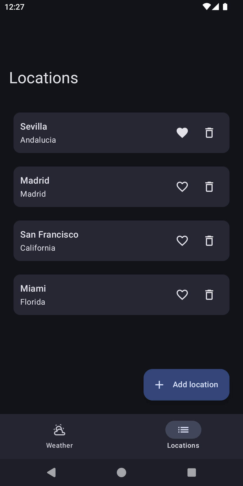
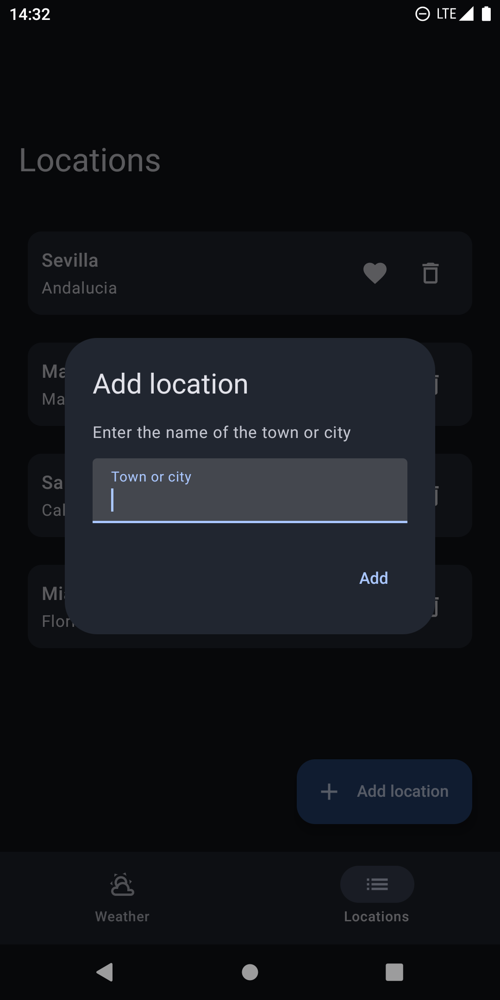

    
    <h1>One2Sky</h1>
    <h5>⛅ A simple Android app for weather forecasts ⛅</h5>
    
    

## Description

**One2Sky** is a simple Android weather & forecasts app made in Compose that uses [wttr.in](https://github.com/chubin/wttr.in) API.

## Features

- Current weather information and forecast
- View the weather from the location derived from your IP or from your saved locations
- Search and save the locations you want and mark it as favorite to show it every time you open the app

## Architecture overview

This project follows **Clean Architecture** and is separated into three main layers: presentation, domain and data. To truly achieve this separation, a multi-module approach was used. This way, the data layer and the presentation layer are not visible to each other, and each one only depends on the domain layer, like shown in this diagram:

*Source: Mario Sanoguera at Medium*

And, of course, this project also follows the **MVVM** architectural pattern and the **SOLID** principles when applicable.

## Technical details

- 100% Kotlin, with Coroutines, Flow, and more!
- Jetpack Compose 🚀
- Modern MVVM architecture
- Material 3 & Material You dynamic theming
- Multi-module project following the Clean Architecture principles
- Retrofit for API requests
- Room & Jetpack DataStore for data persistence
- Dependency injection with Hilt
- Testing with JUnit 4, MockK & Turbine
- Use of test fixtures for testing data

## Screenshots

## Download

## Credits

- Original weather icon by Freepik, modified by me
